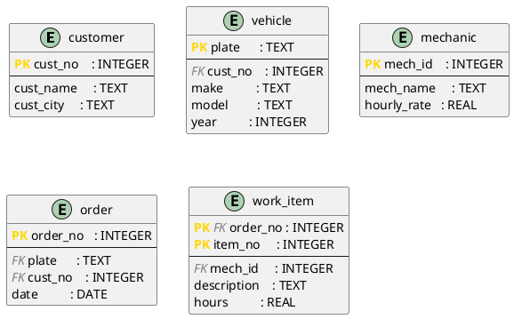

# DBMS_04 – Normalization in Practice: From Plain Text to DDL

**Module:** Databases · THGA Bochum  
**Lecturer:** Stephan Bökelmann · <sboekelmann@ep1.rub.de>  
**Repository:** <https://github.com/MaxClerkwell/DBMS_04>  
**Prerequisites:** DBMS_01, DBMS_02, DBMS_03, Lecture 04 (Normalization)  
**Duration:** 90 minutes

---

## Learning Objectives

After completing this exercise you will be able to:

- Translate a natural-language problem description into a **flat starting table**
- Systematically identify and write down **functional dependencies**
- Decompose the table step by step into **2NF** and **3NF**, verifying losslessness at each step
- Represent the normalized schema as a **PlantUML diagram**
- Implement the schema as **DDL** in SQLite and populate it with sample data
- Formulate three practical **SQL queries** that directly reflect relational algebra

**After completing this exercise you should be able to answer the following questions independently:**

- How do I recognize a partial or transitive dependency in a real table?
- Why is a decomposition only correct if it is lossless?
- When is 3NF sufficient — and when do I need BCNF?

---

## Check Prerequisites

```bash
sqlite3 --version
plantuml -version
git --version
```

> You should see three version strings — SQLite 3.x, PlantUML 1.x, and Git 2.x.
> If a tool is missing, install it:
>
> ```bash
> sudo apt-get install -y sqlite3 plantuml   # Debian / Ubuntu
> brew install sqlite3 plantuml              # macOS
> ```

> **Screenshot 1:** Take a screenshot of your terminal showing all three
> successful version checks and insert it here.
>
> `[insert screenshot]`


---

## 0 – Fork and Clone the Repository

**Step 1 – Fork on GitHub:**  
Navigate to <https://github.com/MaxClerkwell/DBMS_04> and click **Fork**.
Keep the default settings and confirm.

**Step 2 – Clone your fork:**

```bash
git clone git@github.com:<your-username>/DBMS_04.git
cd DBMS_04
ls
```

> You should see only the `README.md`. You will create all further files
> yourself during this exercise.

---

## 1 – The Starting Point: A Workshop and Its Spreadsheet

A small car repair workshop has been managing its repair orders in a single
Excel spreadsheet for years. Each row describes one **work item** within an
order — a single task assigned to a mechanic. The table looks like this
(simplified):

| OrderNo | Date       | CustNo | CustName        | CustCity | Plate       | Make | Model | Year | MechId | MechName   | HourlyRate | ItemNo | Description         | Hours |
|---------|------------|--------|-----------------|----------|-------------|------|-------|------|--------|------------|------------|--------|---------------------|-------|
| 1001    | 2026-03-10 | K01    | Berger, Franz   | Bochum   | BO-AB 123   | VW   | Golf  | 2018 | M03    | Huber, Tom | 65.00      | 1      | Oil change          | 0.5   |
| 1001    | 2026-03-10 | K01    | Berger, Franz   | Bochum   | BO-AB 123   | VW   | Golf  | 2018 | M03    | Huber, Tom | 65.00      | 2      | Replace air filter  | 0.3   |
| 1002    | 2026-03-11 | K02    | Novak, Jana     | Herne    | HER-XY 44   | Ford | Focus | 2020 | M01    | Schulz, P. | 60.00      | 1      | Front brake pads    | 1.5   |
| 1003    | 2026-03-12 | K01    | Berger, Franz   | Bochum   | BO-CD 999   | BMW  | 320i  | 2019 | M03    | Huber, Tom | 65.00      | 1      | Service inspection  | 2.0   |
| 1003    | 2026-03-12 | K01    | Berger, Franz   | Bochum   | BO-CD 999   | BMW  | 320i  | 2019 | M01    | Schulz, P. | 60.00      | 2      | Tyre change         | 0.8   |

The primary key of this flat table is `(OrderNo, ItemNo)` — every combination
of order number and item number appears exactly once.

### Task 1a – Identify Anomalies

Read the table carefully and describe one concrete example of each:

1. **Update anomaly:** Which rows would need to be changed simultaneously if
   mechanic Huber raises his hourly rate to 70.00?
2. **Insert anomaly:** Can a new mechanic be added before they work on their
   first order? What is missing?
3. **Delete anomaly:** What information is permanently lost if order 1002 is
   deleted entirely?

> *Your answers:* -Update anomaly: If mechanic Huber (M03) raises his hourly rate to 70.00, we must update multiple rows simultaneously (rows 1, 2, and 4 in the example). If we miss even one row, the database becomes inconsistent, showing different hourly rates for the same mechanic.
> -Insert anomaly: We cannot add a newly hired mechanic (or a new customer) to the database until they are actually assigned to a work item. This is because OrderNo and ItemNo form the primary key and cannot be NULL.
> -Delete anomaly: If we delete order 1002 (e.g., if the order was cancelled), we permanently lose all information about customer Novak (K02) and her Ford Focus, because this was her only order in the system.

### Task 1b – Write Down Functional Dependencies

List all non-trivial functional dependencies you can identify in the flat table.
Use the notation $X \rightarrow Y$.

Hints:
- Which attributes uniquely determine the customer?
- Which attributes follow from the licence plate alone?
- What does a single mechanic ID determine?
- What only follows from the combination `(OrderNo, ItemNo)`?

> *Your FD list:*
> CustNo -> CustName, CustCity
> Plate -> Make, Model, Year, CustNo
> MechId -> MechName, HourlyRate
> OrderNo -> Date, Plate
> (OrderNo, ItemNo) -> MechId, Description, Hours

### Questions for Task 1

**Question 1.1:** Is `CustNo → CustCity` a *full* or *partial* dependency with
respect to the primary key `(OrderNo, ItemNo)`? Justify your answer using the
definition from Lecture 04.

> *Your answer:* It is neither a full nor a partial dependency with respect to the primary key. A partial dependency occurs when a non-key attribute depends on only a part of a composite primary key. CustNo is not part of the primary key at all. Instead, CustNo -> CustCity represents a transitive dependency (since OrderNo -> Plate -> CustNo -> CustCity).

**Question 1.2:** Identify a transitive dependency in the flat table and explain
why it violates 3NF.

> *Your answer:* A clear transitive dependency is Plate -> CustNo -> CustName. The car's Plate determines the CustNo, which in turn determines the CustName. This violates the Third Normal Form (3NF) because 3NF requires that non-key attributes depend only on the primary key, not on other non-key attributes.

**Question 1.3:** Compute the attribute closure $\{\mathrm{OrderNo}\}^+$ using
your FD list. Is `OrderNo` alone a superkey of the flat table?

> *Your answer:* OrderNo+ = {OrderNo, Date, Plate, Make, Model, Year, CustNo, CustName, CustCity}.
No, OrderNo alone is not a superkey. Its closure does not contain all the attributes of the relation (it is missing ItemNo, MechId, MechName, HourlyRate, Description, and Hours).

---

## 2 – Normalization

### Task 2a – Decompose into 2NF

All attributes that depend only partially on the primary key `(OrderNo, ItemNo)`
must be moved into separate relations. Work out the decomposition on paper first,
then fill in the table below.

**Result (fill in):**

| Relation       | Attributes                                         | Primary Key            |
|----------------|----------------------------------------------------|------------------------|
| `customer`     | `cust_no`, `cust_name`, `cust_city`               | `cust_no`              |
| `vehicle`      | `plate`, `make`, `model`, `year`, `cust_no`       | `plate`                |
| `mechanic`     | `mech_id`, `mech_name`, `hourly_rate`             | `mech_id`              |
| `order`        | `order_no`, `date`, `plate`, `cust_no`            | `order_no`             |
| `work_item`    | `order_no`, `item_no`, `mech_id`, `description`, `hours` | `(order_no, item_no)` |

Check: In every relation, does each non-key attribute depend on the **complete**
primary key?

> *Your check:* Yes. In every relation, each non-key attribute depends on the complete primary key. The partial dependencies on the composite key (order_no, item_no) from the flat table have been successfully eliminated by moving attributes dependent only on order_no to the order table, and attributes dependent only on mech_id to the mechanic table.

### Task 2b – Decompose into 3NF

Examine `order` and `vehicle` for transitive dependencies.

- In `order`: does `cust_no` depend directly on `order_no`? Does `cust_name`
  transitively depend on it through `cust_no`? *(After the 2NF split,
  `cust_name` should already be in `customer` — verify that this is correct.)*
- In `vehicle`: is there a dependency between `plate` and `cust_no` that
  requires a further split, or is `vehicle` already in 3NF?

State your conclusion: are all five relations from Task 2a already in 3NF?
If not, perform the missing decomposition.

> *Your analysis and any further decomposition:*
> In vehicle: There is no transitive dependency. make, model, and year depend directly on plate. cust_no is a foreign key linking to the owner. It is in 3NF.
> In order: At first glance, it might seem like order_no -> plate -> cust_no is a transitive dependency. However, the cust_no in the order table represents the "billing customer" (the person placing and paying for the order), which could theoretically be different from the vehicle's registered owner. Therefore, cust_no depends directly on order_no.
> Conclusion: All five relations are already in 3NF. No further decomposition is needed.

### Task 2c – Verify Losslessness

Pick one of the decompositions you performed (e.g. the split of the original
table into `order` and `vehicle`) and verify it using the **Heath criterion**:

$$R_1 \cap R_2 \rightarrow R_1 \setminus R_2 \quad \text{or} \quad R_1 \cap R_2 \rightarrow R_2 \setminus R_1$$

Name the shared attributes, state the FD you rely on, and conclude whether the
decomposition is lossless.

> *Your verification:* Let's verify the decomposition of the flat table (R) into work_item (R1) and order_info (R2). Shared attribute (R1 && R2): order_no. The FD we rely on is: order_no -> date, plate, cust_no, ... (which is R2 \ R1). Since R1 && R2 -> R2\R1 is a valid functional dependency, the Heath criterion is satisfied. The decomposition is lossless, meaning we can accurately reconstruct the original table using natural joins.

### Questions for Task 2

**Question 2.1:** Why must `cust_no` remain as a foreign key in `order` even
though the customer is also reachable via the vehicle's licence plate?
Describe a realistic scenario where the direct link `order → customer` is
necessary.

> *Your answer:* It is necessary because the customer who brings the car in and pays the bill (the order customer) might not be the registered owner of the vehicle (the vehicle customer). A realistic scenario is a parent bringing their child's car for repair and paying the bill, or an employee bringing in a company car.

**Question 2.2:** Is the schema after the 3NF decomposition also in BCNF?
Justify your answer using the definition: for every non-trivial FD $X \rightarrow Y$,
$X$ must be a superkey.

> *Your answer:* Yes, the schema is in BCNF. In our normalized schema, for every non-trivial functional dependency X -> Y, the determinant X is a superkey. There are no overlapping candidate keys where a non-key attribute determines a part of a candidate key.

**Question 2.3:** The hourly rate of a mechanic is stored in `mechanic`. If a
mechanic changes their rate during the year, what problem arises for already
completed orders? How could the schema be extended to correctly record
historical hourly rates?

> *Your answer:* If the rate is updated in the mechanic table, all past work items linked to that mechanic will suddenly appear to have been billed at the new, higher rate, destroying historical financial accuracy. To fix this, the schema should be extended by either storing the applied hourly_rate directly in the work_item table at the time the work is done, or by creating a mechanic_rate_history table with validity dates (start_date, end_date).

---

## 3 – Schema Diagram

### Task 3a – Create the PlantUML File

Create `schema.puml` in the repository directory:

```bash
vim schema.puml
```

> If you have never used Vim, run `vimtutor` in your terminal first — a
> self-contained 30-minute interactive lesson. The essential commands:
> - `i` — enter Insert mode (you can type)
> - `Esc` — return to Normal mode
> - `:w` — save the file
> - `:wq` — save and quit
> - `:q!` — quit without saving

Transfer your normalized schema into PlantUML IE notation. Use the following
skeleton and add the missing attributes and relationships according to your
result from Task 2:



Add the missing relationship lines. Every foreign key relationship needs one
line. PlantUML IE multiplicity notation:

| Notation | Meaning |
|----------|---------|
| `\|\|` | exactly one |
| `o{` | zero or many |
| `\|{` | one or many |
| `o\|` | zero or one |

### Task 3b – Render and Review

```bash
plantuml -tsvg schema.puml
```

Open `schema.svg` in a browser and check:
- Are all five entities visible?
- Does every foreign key relationship show the correct multiplicity?
- Are PK and FK correctly marked?

If you are working on the student server, copy the file to your local machine first:

```bash
scp <username>@<server>:/path/to/DBMS_04/schema.svg ~/Downloads/schema.svg
```

> **Screenshot 2:** Take a screenshot showing the rendered diagram with all
> five entities and their relationships.
>
> `[insert screenshot]`


### Task 3c – Commit

```bash
git add schema.puml
echo "schema.svg" >> .gitignore
echo "*.db"       >> .gitignore
git add .gitignore
git commit -m "docs: normalized schema diagram for workshop management"
```

---

## 4 – DDL: Implement the Schema in SQLite

### Task 4a – Write schema.sql

```bash
vim schema.sql
```

Write `CREATE TABLE` statements for all five relations. Requirements:

- Every table must have an explicit `PRIMARY KEY` constraint.
- Every foreign key must be declared with `ON DELETE` and `ON UPDATE` actions —
  choose the most restrictive action that is still domain-correct.
- `work_item.hours` must be greater than zero: `CHECK (hours > 0)`.
- `mechanic.hourly_rate` must also be greater than zero.
- Use SQLite types only (`INTEGER`, `TEXT`, `REAL`, `DATE`).

<details>
<summary>Solution skeleton — try it yourself first</summary>

```sql
PRAGMA foreign_keys = ON;

CREATE TABLE customer (
    cust_no   INTEGER PRIMARY KEY,
    cust_name TEXT    NOT NULL,
    cust_city TEXT    NOT NULL
);

CREATE TABLE vehicle (
    plate    TEXT    PRIMARY KEY,
    cust_no  INTEGER NOT NULL,
    make     TEXT    NOT NULL,
    model    TEXT    NOT NULL,
    year     INTEGER NOT NULL,
    FOREIGN KEY (cust_no) REFERENCES customer(cust_no)
        ON DELETE RESTRICT ON UPDATE CASCADE
);

CREATE TABLE mechanic (
    mech_id     INTEGER PRIMARY KEY,
    mech_name   TEXT    NOT NULL,
    hourly_rate REAL    NOT NULL CHECK (hourly_rate > 0)
);

CREATE TABLE "order" (
    order_no INTEGER PRIMARY KEY,
    plate    TEXT    NOT NULL,
    cust_no  INTEGER NOT NULL,
    date     DATE    NOT NULL,
    FOREIGN KEY (plate)   REFERENCES vehicle(plate)
        ON DELETE RESTRICT ON UPDATE CASCADE,
    FOREIGN KEY (cust_no) REFERENCES customer(cust_no)
        ON DELETE RESTRICT ON UPDATE CASCADE
);

CREATE TABLE work_item (
    order_no    INTEGER NOT NULL,
    item_no     INTEGER NOT NULL,
    mech_id     INTEGER NOT NULL,
    description TEXT    NOT NULL,
    hours       REAL    NOT NULL CHECK (hours > 0),
    PRIMARY KEY (order_no, item_no),
    FOREIGN KEY (order_no) REFERENCES "order"(order_no)
        ON DELETE CASCADE ON UPDATE CASCADE,
    FOREIGN KEY (mech_id)  REFERENCES mechanic(mech_id)
        ON DELETE RESTRICT ON UPDATE CASCADE
);
```

> Note: `order` is a reserved word in SQL. It must be quoted with double quotes
> in SQLite, or you rename the table to `repair_order` to avoid the conflict
> entirely — which is often the cleaner choice in practice.

</details>

### Task 4b – Load the Schema and Verify

```bash
sqlite3 workshop.db < schema.sql
sqlite3 workshop.db ".tables"
```

> You should see: `customer  mechanic  order  vehicle  work_item`

> **Screenshot 3:** Take a screenshot showing the `.tables` output.
>
> `[insert screenshot]`


### Task 4c – Insert Sample Data

```bash
vim data.sql
```

Insert the data from the flat table in Section 1, now split across the five
normalized relations. Start with the tables that have no foreign keys
(`customer`, `mechanic`), then `vehicle`, then `order`, and finally `work_item`.

<details>
<summary>Sample data — try it yourself first</summary>

```sql
PRAGMA foreign_keys = ON;

-- Customers
INSERT INTO customer VALUES (1, 'Berger, Franz', 'Bochum');
INSERT INTO customer VALUES (2, 'Novak, Jana',   'Herne');

-- Mechanics
INSERT INTO mechanic VALUES (1, 'Schulz, P.', 60.00);
INSERT INTO mechanic VALUES (3, 'Huber, Tom', 65.00);

-- Vehicles
INSERT INTO vehicle VALUES ('BO-AB 123', 1, 'VW',   'Golf',  2018);
INSERT INTO vehicle VALUES ('HER-XY 44', 2, 'Ford', 'Focus', 2020);
INSERT INTO vehicle VALUES ('BO-CD 999', 1, 'BMW',  '320i',  2019);

-- Orders
INSERT INTO "order" VALUES (1001, 'BO-AB 123', 1, '2026-03-10');
INSERT INTO "order" VALUES (1002, 'HER-XY 44', 2, '2026-03-11');
INSERT INTO "order" VALUES (1003, 'BO-CD 999', 1, '2026-03-12');

-- Work items
INSERT INTO work_item VALUES (1001, 1, 3, 'Oil change',         0.5);
INSERT INTO work_item VALUES (1001, 2, 3, 'Replace air filter', 0.3);
INSERT INTO work_item VALUES (1002, 1, 1, 'Front brake pads',   1.5);
INSERT INTO work_item VALUES (1003, 1, 3, 'Service inspection', 2.0);
INSERT INTO work_item VALUES (1003, 2, 1, 'Tyre change',        0.8);
```

</details>

```bash
sqlite3 workshop.db < data.sql
```

Verify the row counts:

```sql
SELECT 'customer',  COUNT(*) FROM customer
UNION ALL SELECT 'mechanic',  COUNT(*) FROM mechanic
UNION ALL SELECT 'vehicle',   COUNT(*) FROM vehicle
UNION ALL SELECT 'order',     COUNT(*) FROM "order"
UNION ALL SELECT 'work_item', COUNT(*) FROM work_item;
```

> Expected: 2, 2, 3, 3, 5.

Commit:

```bash
git add schema.sql data.sql
git commit -m "feat: DDL and sample data for normalized workshop schema"
```

### Questions for Task 4

**Question 4.1:** `ON DELETE CASCADE` was chosen for the foreign key
`work_item.order_no`, but `ON DELETE RESTRICT` for `vehicle.cust_no`.
Justify both choices in terms of the domain — what does it mean for the
business if an order is deleted versus if a customer is deleted?

> *Your answer:* ON DELETE CASCADE is used for work_item.order_no because a work item is entirely dependent on its parent order; if an order is cancelled/deleted, its items should logically vanish too. However, ON DELETE RESTRICT is used for vehicle.cust_no because a customer might have unpaid invoices or historical data. Deleting a customer while their vehicle (and its repair history) is still in the system would create orphan records and ruin financial accountability.

**Question 4.2:** Test referential integrity by running:

```sql
PRAGMA foreign_keys = ON;
INSERT INTO work_item VALUES (9999, 1, 3, 'Ghost item', 1.0);
```

What error do you get? What does this tell you about the difference between
a constraint declared in DDL and one that is actually enforced at runtime?

> *Your answer:* Test referential integrity... What error do you get?

Your answer: The error is FOREIGN KEY constraint failed. This happens because order number 9999 does not exist in the order table. This tells us that DDL defines the structural rules, but in SQLite, these constraints are ignored by default unless explicitly activated at runtime using PRAGMA foreign_keys = ON;.

**Question 4.3:** Test the CHECK constraint:

```sql
INSERT INTO work_item VALUES (1001, 3, 3, 'Invalid', -0.5);
```

What happens? What would happen if the CHECK constraint were missing?

> *Your answer:* The system throws an error: CHECK constraint failed: hours > 0. The value -0.5 is rejected. If this constraint were missing, the database would accept negative hours, which would result in the workshop owing money to the customer when calculating the final invoice, causing massive financial errors.

---

## 5 – SQL Queries

Save all three queries in a file called `queries.sql`. Write a short comment
before each query describing its purpose.

### Task 5a – All Work Items for a Given Customer

**Task:** List all order numbers, order dates, licence plates, item descriptions,
and hours for customer `Berger, Franz`, ordered by date and item number.

Write the relational algebra expression first (in words or formal notation),
then the SQL query.

```sql
-- Query 5a: insert here
```

<details>
<summary>Expected result</summary>

Four rows: two items from order 1001 (Golf, 2026-03-10) and two items from
order 1003 (BMW 320i, 2026-03-12).

</details>

**Question 5a:** This query joins four tables (`customer`, `order`, `vehicle`,
`work_item`). In what order would the query optimizer ideally perform the joins —
and why does the join order not affect the *result*, but does affect *performance*?

> *Your answer:* The query optimizer would ideally perform the filtering on customer first (WHERE cust_name = 'Berger, Franz') to drastically reduce the number of rows. Then, it would join this tiny result set with the other tables. The join order does not affect the result because INNER JOIN operations are mathematically commutative and associative. However, it heavily affects performance because filtering early and joining smaller intermediate tables requires far less memory and CPU time than joining massive, unfiltered tables.

---

### Task 5b – Total Hours per Mechanic in March 2026

**Task:** For each mechanic, compute the sum of all hours worked on orders whose
date falls in March 2026. Show `mech_name`, `total_hours` (rounded to one decimal
place), and `orders` (the number of distinct orders in which the mechanic had at
least one work item). Sort descending by `total_hours`.

```sql
-- Query 5b: insert here
```

<details>
<summary>Expected result</summary>

| mech_name  | total_hours | orders |
|------------|-------------|--------|
| Huber, Tom | 2.8         | 2      |
| Schulz, P. | 2.3         | 2      |

</details>

**Question 5b:** Using `COUNT(DISTINCT order_no)` counts orders, not items.
What would `COUNT(*)` count instead, and why would the result differ in this
case?

> *Your answer:* COUNT(*) would count the total number of work items (rows) assigned to that mechanic in that month, not the number of distinct orders. Because a single order can contain multiple work items assigned to the same mechanic (e.g., Order 1001 has two tasks for Huber), COUNT(*) would yield a higher number than COUNT(DISTINCT order_no).

---

### Task 5c – Vehicles with No Repair Order

**Task:** Return the licence plate and model of every vehicle for which
**no** order exists in the database.

Use a set-difference approach with `EXCEPT` and also write an alternative using
`NOT EXISTS`.

```sql
-- Variant 1: EXCEPT
-- Query 5c-1: insert here

-- Variant 2: NOT EXISTS
-- Query 5c-2: insert here
```

<details>
<summary>Expected result</summary>

With the data from Task 4c there are no matches — all three vehicles have at
least one order. Insert a fourth vehicle without an order to test the query:

```sql
INSERT INTO vehicle VALUES ('BOT-ZZ 1', 1, 'Toyota', 'Yaris', 2022);
```

After that, the query should return `BOT-ZZ 1 | Yaris`.

</details>

**Question 5c:** `EXCEPT` and `NOT EXISTS` are logically equivalent — they
always produce the same result. Are there situations where one approach should
be preferred in practice? Consider readability and extensibility.

> *Your answer:* NOT EXISTS is generally preferred in practice. It is more readable because it directly expresses the logical intent ("find vehicles where an order does not exist"). More importantly, it is highly extensible: if we decide to add more columns to the result (e.g., vehicle year or make), we only need to change the main SELECT clause. With EXCEPT, we would have to modify both the top and bottom queries to keep their column counts and types perfectly matched.

---

Commit:

```bash
git add queries.sql
git commit -m "feat: three SQL queries on normalized workshop schema"
```

---

## 6 – Reflection

**Question A – Normalization and redundancy:**  
The original flat table had 5 rows and 15 columns. The normalized schema has
5 tables. At which data volume does normalization pay off most — at 5 rows or
at 50,000? Justify with concrete reference to the anomalies from Task 1a.

> *Your answer:* Normalization pays off exponentially at higher data volumes (like 50,000 rows). In our 5-row table, an update anomaly (e.g., changing Huber's rate) only requires modifying 3 rows. It’s manageable but error-prone. In a 50,000-row table, changing his rate might require finding and updating 10,000 individual rows. Missing even one row corrupts the database. Normalization reduces this O(N) operation to an O(1) operation—updating a single row in the mechanic table instantly applies the change everywhere safely.

**Question B – 3NF vs. BCNF:**  
Lecture 04 explains that BCNF is not always dependency-preserving. Is this
relevant for the workshop schema? Would a BCNF decomposition have looked
different from the 3NF decomposition here?

> *Your answer:* For this specific workshop schema, the 3NF decomposition is already in BCNF. BCNF requires that for every non-trivial functional dependency X -> Y, X must be a superkey. In our normalized tables (customer, vehicle, mechanic, order, work_item), every determinant is indeed a primary key (or candidate key). Therefore, a BCNF decomposition would not look any different from our 3NF decomposition; no dependencies are lost.

**Question C – Redundant foreign key in `order`:**  
`order` contains both `plate` (FK → `vehicle`) and `cust_no` (FK → `customer`).
Since `vehicle` itself contains `cust_no`, one might argue that `cust_no`
in `order` is redundant and violates 3NF. Is that correct? When would such
a deliberate denormalization be justified?

> *Your answer:* It is not redundant, and removing it would be a critical business error. The cust_no in the vehicle table represents the registered owner of the car. The cust_no in the order table represents the payer/client for that specific repair job. Often they are the same, but in real life, a parent might pay for a child's car repair, or an employee might bring in a company vehicle. Deliberate denormalization is only justified to heavily optimize read-heavy analytical queries, but here, keeping both is a functional requirement, not redundancy.

**Question D – NULL and order status:**  
An order that has just been created may have no work items yet. What does the
current schema say about this case? Would the schema need to be extended to
correctly represent an order's status (open / completed)? Sketch the necessary
change.

> *Your answer:* Currently, an order with no work items is simply a row in the order table that has no corresponding rows in the work_item table. It does not require NULL values. However, to explicitly manage workflow status without relying solely on the presence/absence of work items, we should add a status column to the order table (e.g., status TEXT CHECK(status IN ('Open', 'In Progress', 'Completed', 'Billed')) DEFAULT 'Open').

> **Screenshot 4:** Take a screenshot showing the output of Query 5b directly
> in `sqlite3` (with `.headers on` and `.mode column` activated).
>
> `[insert screenshot]`


---

## Bonus Tasks

1. **Hourly rate history:** Design a schema extension that allows recording a
   mechanic's hourly rate historically — i.e. which rate applied at the time a
   specific order was processed. Write the modified `CREATE TABLE` statements.

2. **Spare parts:** The workshop also charges for parts in addition to labour.
   Extend the schema with a `part` table and a `order_part` join table that
   records which parts were used in which order. Maintain normal form and
   referential integrity.

3. **Total invoice per order:** Write a query that computes the total amount for
   each order: the sum of `hours × hourly_rate` across all work items. Which
   tables need to be joined?

4. **GitHub Actions:** Add a workflow file `.github/workflows/release.yml` that
   installs PlantUML, renders `schema.puml` to `schema.svg`, and publishes it
   as a release artifact on every `v*` tag. Trigger a release with
   `git tag v1.0.0 && git push --tags`.

---

## Further Reading

- E. F. Codd (1972): *Further Normalization of the Data Base Relational Model.* In: Rustin (ed.): Data Base Systems.
- [SQLite – CHECK Constraints](https://www.sqlite.org/lang_createtable.html#check_constraints)
- [SQLite – Foreign Key Support](https://www.sqlite.org/foreignkeys.html)
- [PlantUML – Entity Relationship Diagram](https://plantuml.com/ie-diagram)
- Lecture 04 handout – *Normalization*
